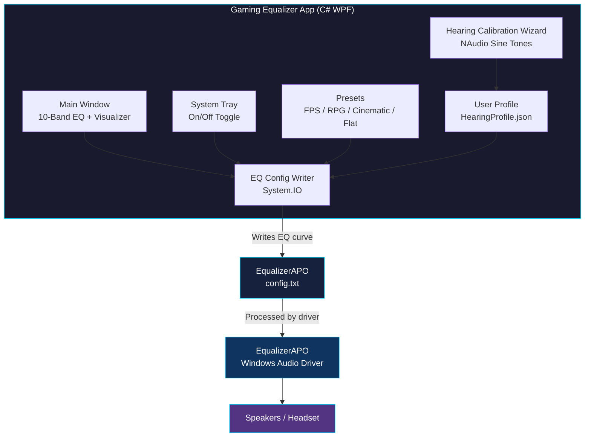

# Gaming Equalizer App: Concept Document

## Overview

A Windows desktop application that applies system-wide audio equalization for PC gamers. It runs in the background via a system tray icon and lets users switch EQ profiles instantly. A built-in hearing calibration wizard generates a personal EQ curve based on the user's hearing thresholds.

---

## Goals

- Apply system-wide EQ without requiring users to configure audio drivers manually
- Let users toggle the EQ on and off with one click
- Provide gaming-specific presets out of the box
- Offer optional hearing calibration for a personalized audio profile

---

## Tech Stack

| Layer | Technology |
|---|---|
| Language | C# (.NET 8) |
| UI Framework | WPF (Windows Presentation Foundation) |
| Audio Processing | EqualizerAPO (system-wide EQ driver) |
| Audio Playback | NAudio (for calibration tones) |
| Config Management | System.IO (read and write EqualizerAPO config files) |
| System Tray | WPF + Windows Forms NotifyIcon |

---

## Architecture

The app acts as a frontend controller. EqualizerAPO handles all system-wide audio processing. The app reads and writes EqualizerAPO config files to apply or change EQ settings in real time.



---

## Core Features

### 1. System-Wide EQ

- 10-band equalizer covering 32Hz to 16kHz
- Band center frequencies: 32, 64, 125, 250, 500, 1000, 2000, 4000, 8000, 16000 Hz
- Gain range per band: ±12 dB
- Filter type: Peaking EQ (bell curve), Q = 1.41
- Changes apply instantly to all audio on the PC
- EQ curve written to: `C:/Program Files/EqualizerAPO/config/config.txt`

### 2. On/Off Toggle

- Single button in the app and system tray right-click menu
- On state: writes active EQ curve to config file
- Off state: writes flat bypass config to config file
- No app restart or audio driver restart required

### 3. Gaming Presets

| Preset | Description |
|---|---|
| FPS | Boosted highs for footstep clarity, reduced bass |
| RPG | Balanced mids, enhanced low-end for immersion |
| Cinematic | Wide soundstage, boosted bass and treble |
| Flat | No EQ applied, neutral output |

### 4. Hearing Calibration Wizard

An optional feature accessible from the settings menu.

Process:
1. App plays a pure sine tone at a set frequency
2. User adjusts the volume slider until the tone is barely audible
3. App records the threshold level for that frequency
4. Repeat across 7 frequencies: 125Hz, 250Hz, 500Hz, 1kHz, 2kHz, 4kHz, 8kHz
5. App generates a compensation EQ curve from the recorded thresholds
6. Curve applies automatically on app startup as a base layer under gaming presets

Calibration data stored per user:
- Frequency thresholds (Hz and dB)
- Headphone model (user-entered)
- Date of calibration

Calibration algorithm:
1. Record the user's threshold level (dB) at each frequency
2. Calculate gain offset: `gain = -(threshold_dB - reference_dB)` where reference is 0 dB (full volume)
3. Clamp each gain to ±12 dB
4. Normalize so the loudest band is 0 dB (avoid overall volume boost)
5. Apply as a base EQ layer; gaming preset gains are added on top

Note: This is relative calibration, not clinical audiometry. Results depend on headphone quality and ambient noise. Best results in a quiet room with consistent volume.

### 5. Launch with Windows

- Optional setting toggled in the settings screen
- Writes app path to `HKCU\Software\Microsoft\Windows\CurrentVersion\Run` when enabled
- Removes the registry entry when disabled
- App starts minimized to tray when launched this way

### 6. Real-Time Frequency Visualizer

- Canvas-based animated EQ bar display
- Updates in real time as presets or manual adjustments are applied
- Dark UI with neon accent colors

---

## System Tray Behavior

- App minimizes to system tray on close
- Right-click tray icon shows: Toggle EQ on/off, Open App, Quit
- Tray icon changes color to indicate EQ state (active vs bypassed)

---

## State Persistence

The following state is saved to `AppSettings.json` in the user's `%AppData%\GamingEqualizer\` folder and restored on every launch:

| Setting | Default |
|---|---|
| Active preset | Flat |
| EQ on/off state | On |
| Per-band gain values (if manually adjusted) | All 0 dB |
| Launch with Windows | Off |
| Last calibration applied | None |

---

## Permissions & UAC

Writing to `C:\Program Files\EqualizerAPO\config\config.txt` requires elevated access. The app uses one of two strategies:

- **Preferred:** The app manifest requests `requireAdministrator` — Windows prompts for UAC elevation once on launch.
- **Fallback:** If elevation is unavailable, the app writes to a user-writable redirect path and uses an EqualizerAPO `Include` directive to chain the file.

The chosen strategy is documented in the app manifest (`app.manifest`) and must not be changed without testing the EqualizerAPO config reload behavior.

---

## Error Handling Policy

| Failure | Behavior |
|---|---|
| Config write fails (permissions) | Show non-blocking error banner; EQ state reverts to last known good |
| Config file locked by another process | Retry once after 200ms; if still locked, show error and leave previous config in place |
| NAudio device unavailable during calibration | Show dialog: "No audio output device found. Connect headphones and try again." Cancel wizard. |
| EqualizerAPO not detected at startup | Show blocking prompt with download link; all EQ controls disabled until detected |
| Corrupted preset or profile JSON | Skip the file, log to `%AppData%\GamingEqualizer\error.log`, fall back to Flat preset |

---

## EqualizerAPO Dependency

EqualizerAPO must be installed for the app to function. On first launch, the app checks for its presence at the expected install path. If not found, the app shows a prompt with a direct download link and installation instructions.

Detection path: `C:/Program Files/EqualizerAPO/`

---

## Folder Structure

```
GamingEqualizer/
  GamingEqualizer.csproj
  app.manifest
  App.xaml
  App.xaml.cs
  MainWindow.xaml
  MainWindow.xaml.cs
  CalibrationWizard.xaml
  CalibrationWizard.xaml.cs
  TrayController.cs
  EQConfigWriter.cs
  PresetManager.cs
  Models/
    Preset.cs
    HearingProfile.cs
    AppSettings.cs
  Presets/
    FPS.json
    RPG.json
    Cinematic.json
    Flat.json
  UserProfiles/
    HearingProfile.json  (generated at runtime, stored in %AppData%)
  Assets/
    tray-icon-on.ico
    tray-icon-off.ico
```

---

## NuGet Dependencies

- NAudio: sine tone generation for calibration wizard
- Newtonsoft.Json: read and write preset and profile JSON files

---

## Out of Scope (v1)

- Mac or Linux support
- Per-app EQ (different EQ per game or application)
- Microphone processing or noise suppression
- Cloud sync of user profiles
- Left and right ear calibration (possible in v2)

---

## Development Phases

### Phase 1: Core App
- WPF window with 10-band EQ UI
- EqualizerAPO config file writer
- On/off toggle with system tray icon
- Flat and cinematic presets

### Phase 2: Presets and Visualizer
- Full preset library (FPS, RPG, cinematic, flat)
- Real-time frequency visualizer
- Preset switching UI

### Phase 3: Hearing Calibration
- Calibration wizard with NAudio sine tones
- Threshold recording and EQ curve generation
- Profile save and load

### Phase 4: Polish
- EqualizerAPO install detection and prompt
- App startup with Windows option
- Settings screen
- Installer package (MSIX or NSIS)

---

## Key Constraints

- Windows only (EqualizerAPO is Windows-exclusive)
- EqualizerAPO must be installed separately; app requires admin elevation to write to its config directory
- Calibration accuracy depends on user environment and headphone quality
- System-wide EQ affects all audio, including communication apps
- .NET 8 runtime must be present on the target machine (bundled in installer or self-contained publish)
